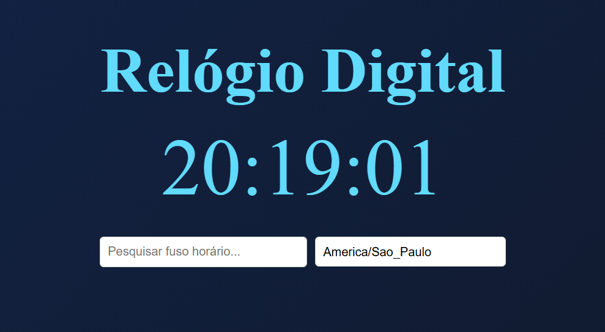

# Relógio Digital



## Demo ao Vivo
[Ver projeto funcionando](https://mbarros-ux.github.io/Relogio-digital/)

## Sobre
Relógio digital desenvolvido com JavaScript puro para praticar conceitos básicos de programação e manipulação do DOM. O projeto exibe a hora atual e data em tempo real com atualização automática.

Este foi um dos primeiros projetos com JavaScript, focado em entender como manipular elementos HTML dinamicamente.

## Tecnologias Utilizadas
- JavaScript - Lógica de programação e manipulação do DOM
- HTML5 - Estrutura da página
- CSS3 - Estilização e layout responsivo

## Funcionalidades
- Exibição da hora atual em tempo real
- Atualização automática a cada segundo
- Display da data completa (dia, mês, ano)
- Formato 24 horas
- Interface simples e limpa
- Layout responsivo

## Como Executar

1. Clone este repositório:
```bash
git clone https://mbarros-ux/Relogio-digital.git
